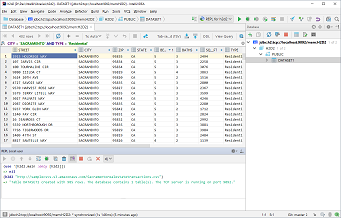

# H2-D2

[](https://clojars.org/h2d2)

H2 driven data visualisation droid for Clojure data scientists. 

H2D2 loads files, urls, core.matrix datasets/matrices and clojure data 
structures into an in-memory H2 database, for visualisation via your 
favourite SQL GUI.

H2D2 was developed with fully-featured IDEs in mind (e.g. IntelliJ IDEA) 
to provide a dataset viewing experience similar to Matlab, with added 
SQL benefits such as sorting and filtering/querying.

[](screenshot.png)

Once you've configured your SQL GUI to point to H2D2's database 
(which you just have to do once and for all), viewing a dataset 
is a straightforward as typing:

```clojure
    (h2d2 "mydata.csv")
    (h2d2 "http://mydomain/mydata.csv")
    (h2d2 mydataset)
    (h2d2 mymatrix)
    (h2d2 [[0 1 1] [0 1 0] [1 0 0]])
    (h2d2 [{:name "Jill"} {:name "Jack"}])
```

H2D2 also provides utility functions to import CSV files and Clojure data structures into any H2 database.

## Release Status

H2D2 is production ready and I'm inviting you to use the snapshot version 
and let me know how it goes. I'll use H2D2 a bit more and will write a few more tests 
before I give it a stable release version number.


## Installation

Add the H2D2 library to your `~/lein/profiles.clj` or to your `project.clj`:

```clojure
[h2d2 "0.1.0-SNAPSHOT"]
```

Import the `h2d2` function in your current namespace:

```clojure
(use '[h2d2.main :only [h2d2]])
```

H2D2 will create it's own in-memory database (called `H2D2`), which will reside in / 
be served from your REPL process; so closing the REPL will destroy the database. 

Give a thought to what port your SQL GUI and H2D2's database will use 
to communicate. If you don't have an H2 server running on your machine 
already, H2D2 will start one on port 9092. However, if an H2 server is 
already running on port 9092 then H2D2 will select a new port automatically 
each time it starts. You can instruct H2D2 to use a port number of your 
choosing so that you don't have to reconfigure your GUI everytime; use 
a port in IANA's unregistered range 49152-65535, or perhaps in the 
9094-9099 range which is part of IANA's registered range but is unassigned 
at the time of writing. 


You may now setup a new datasource in your SQL GUI:

- Database type: H2

- Driver: download the latest H2 driver (e.g. `h2-1.4.197.jar`) 
via the **binary** link on the 
[H2 download page](http://www.h2database.com/html/download.html) 
or from [Maven](http://repo2.maven.org/maven2/com/h2database/h2/).

- Connection URL: `jdbc:h2:tcp://localhost:9092/mem:H2D2`. 
This corresponds to:
  - Connection mode: remote (tcp)
  - Host: `localhost`
  - Port: `9092` (default) or the port of your choosing
  - Database: `mem:H2D2`
  
In the clojure REPL, create the H2D2 in-memory database and start 
the H2 server by uploading a first dataset:

```clojure
    (h2d2 [{:name "Jill"} {:name "Jack"}])
```

Or, if you want to use a custom port:

```clojure
     (h2d2 [{:name "Jill"} {:name "Jack"}] :port 50000)
```

This will return a string that tells on which port number the database 
server was started. You can change this port at anytime:

```clojure
    (h2d2 :port 50001)
```

You can then view your data in your SQL GUI (it may need to be refreshed 
so that the table appears in it), and you can add new datasets by 
running the h2d2 function again. Once the data is in the H2D2 database, 
you can run any SQL query on it and create new tables derived from it.
You can download the content of any table (e.g. `sometable`) as a vector of maps
back in your REPL environment with the command:

```clojure
(h2d2 :all :sometable)
``` 

## Usage

H2D2 is all about database side-effects, and it is very much shell-like and imperative 
in style rather than functional. 

It's arguments are slightly different for CSV files and for Clojure data structures.


### CSV files

H2D2 uses H2's built-in CSV import facilities and therefore 
follows the way H2 does things.

```clojure
(h2d2 "http://samplecsvs.s3.amazonaws.com/Sacramentorealestatetransactions.csv")
(h2d2 "testresources/artist_data.csv")

; specific table name
(h2d2 "testresources/artist_data.csv" :table :artists)

; specific charset to ensure proper character conversion
(h2d2 "testresources/artist_data.csv" :charset :utf-8)

; provide column names if (and only if) the CSV file doesn't have a header
(h2d2 "testresources/Traffic enforcement cameras noheader.csv"
      :table :trafficcams
      :columns [:locationcode :location :contraventioncode
                :contravention :activesince :hours]
      :charset :utf-8 )

; custom separator and comment line marker
(h2d2 "testresources/random-space.csv" :separator \space :comment \#)

; change the database server port in the same go
(h2d2 "testresources/random-tab.txt" :separator \tab :port 56789)
```

Column names should only be provided if the CSV file doesn't have a header.
If column names are supplied then H2D2 will interpret the first row of the 
file as data; if not then H2D2 will interpret the first row of the 
file as header.  

### Clojure data structures

H2D2 transforms matrices and data structures into `core.matrix` datasets before 
uploading them into H2. H2D2's behaviour (e.g. default column naming) will 
therefore match the familiar behaviour of function 
`clojure.core.matrix.dataset/dataset`.

Unlike CSV files, it doesn't make a difference to the data if you supply 
column names or not.

```clojure
; load a core.matrix dataset with default behaviour
(def ds (clojure.core.matrix.dataset/dataset [:a :b] (partition 2 (range 100))))
(h2d2 ds)

; load a core.matrix dataset with (all optional) table name, columns and type
(h2d2 ds 
      :table :mydataset 
      :columns [:id :value] 
      :type :int)

; load a core.matrix with (all optional) table name and type
(def m (clojure.core.matrix/diagonal-matrix (range 20)))
(h2d2 m 
      :table :mymatrix
      :type :double)

; load a vector of vectors
(h2d2 [[1 "Jill"] [2 "Jack"] [3 "Joan"]]
      :columns [:id :name]
      :table :forenames)
      
; load a vector of maps
(h2d2 [{:id 1 :name "Jill"} 
       {:id 2 :name "Jack"} 
       {:id 3 :name "Joan"}])
```

### Type conversions

By default, all data is uploaded as `VARCHAR(MAX)` into the database. 
you can convert the whole dataset to a different data type with the 
`:type` option, for example if your dataset is entirely numeric. 
Type definitions follow
[clojure.java.jdbc](http://clojure-doc.org/articles/ecosystem/java_jdbc/using_ddl.html).

```clojure
(h2d2 mydata :type :int)
(h2d2 mydata :type :double)
(h2d2 mydata :type "varchar(10)")
```

H2D2 favors ease of use over granularity, so it doesn't allow 
casting different columns to different types. 


### Accessory Functions

If the first argument passed to `h2d2` is a keyword (or if it is called 
without any argument) then `h2d2` will execute
special actions.

```clojure
(h2d2)                       ; return the status of the database and tcp server
(h2d2 :list)                 ; return the list of tables in the database
(h2d2 :all :dataset1)        ; return the whole content of DATASET1
(h2d2 :top 10 :dataset1)     ; return the top 10 rows in table DATASET1
(h2d2 :drop :dataset1)       ; drop table DATASET1 from the database
(h2d2 :wipe)                 ; clear the database
(h2d2 :close)                ; close the database and the tcp server
(h2d2 :port 56789)           ; change the port of the H2 server
(h2d2 :tcp :stop)            ; stop the H2 server
(h2d2 :tcp :start)           ; start the H2 server
(h2d2 :db)                   ; return the spec of the h2d2 database                      
```

### Non-blocking calls
 
The h2d2 function will block your REPL until it has completed.
If you are loading a large file and you don't want to block
your REPL, you can use the function `h2d2go`.

```clojure
(use '[h2d2.main :only [h2d2 h2d2go]])

(h2d2go "very-large-file.csv")
```

This will run the upload in the background and print the result 
message later. However, new uploads and deletions will block until 
the background upload is over. So use ```h2d2go``` again for new uploads
and deletions if the current background task hasn't completed yet.

```clojure

; these will run synchronously, and will wait/block 
; if any upload or deletion is currently running
(h2d2 "another-file.csv")
(h2d2 another-dataset)
(h2d2 :drop :some-table)
(h2d2 :wipe)

; these will run asynchronously, and will wait behind the scenes
; if any upload or deletion is currently running
(h2d2go "another-file.csv")
(h2d2go another-dataset)
(h2d2go :drop :some-table)
(h2d2go :wipe)

; these will run synchronously and execute at once 
; whether any upload or deletion is currently or not
(h2d2)
(h2d2 :list)
(h2d2 :top 10 :some-table)
(h2d2 :close) 
```

Note that background tasks started with `h2d2go` will execute 
in random order. `h2d2go` just fires off a new thread that will 
block until the current task has completed. `h2d2go` is equivalent 
to the following line of code, with a bit of exception catching on top:

```clojure
(future (println (h2d2 some-data)))
``` 

Automated tests remain to be written for `h2d2go`.

### Importing data into any H2 database

The `h2d2` function strictly targets its own memory database. However, the namespace 
`h2d2.db` contains functions `import-csv` and `import-data` to import CSV files and 
clojure data structures into any H2 database. Their arguments
are similar to the `h2d2` function except for the following differences:
 
* You need to provide the spec of your H2 database.

* You need to provide an explicit table name as string (beware that the functions 
will attempt to delete any table that has this name already).

* Whereas `h2d2` returns status messages, these functions return the name of the table 
  as well as the number of inserted rows.

* Calls are not synchronised, so two threads can run these functions simultaneously.

* You'll need to write your own SQL to query your H2 database and the new tables. 
  The `h2d2` function only works with the H2D2 in-memory database.

```clojure

(def db {:classname   "org.h2.Driver"
         :subprotocol "h2"
         :subname     "~/my-data/my-h2-file"
         :user        "" 
         :password    ""})
         
; Import a csv file. The presence of the :columns argument still dictates whether 
; the first row of the CSV file should be interpreted as column names or not.
(h2d2.db/import-csv db 
                    "testresources/Traffic enforcement cameras noheader.csv"
                    "TRAFFICCAMS"
                    :columns [:locationcode :location :contraventioncode
                              :contravention :activesince :hours]
                    :separator \, 
                    :comment \#          
                    :charset :utf-8 )

; Import a dataset or any other data structure. 
(h2d2.db/import-data db 
                     mydata 
                     "MYDATA" 
                     :columns [:id :value] 
                     :type :int)
```


## License

Copyright © 2018 Nicolas Duchenne, Belove Ltd, London, UK

Released under the [MIT License](https://opensource.org/licenses/MIT).

The Software includes copies of the following licensed datasets, which are 
used to test the Software and are located in the `testresources` directory:

* [Traffic enforcement cameras.csv](https://data.gov.uk/dataset/cctv-traffic-enforcement-camera-locations)

  Copyright © Crown Copyright, licensed under the 
[Open Government Licence v3.0](http://www.nationalarchives.gov.uk/doc/open-government-licence/version/3/)

  copied 30 March 2018

* [artist_data.csv](https://github.com/tategallery/collection/blob/master/artist_data.csv)

  Copyright (c) Tate, licensed under the 
[Creative Commons Zero 1.0 Public Domain Dedication](https://creativecommons.org/publicdomain/zero/1.0/)

  copied 30 March 2018
